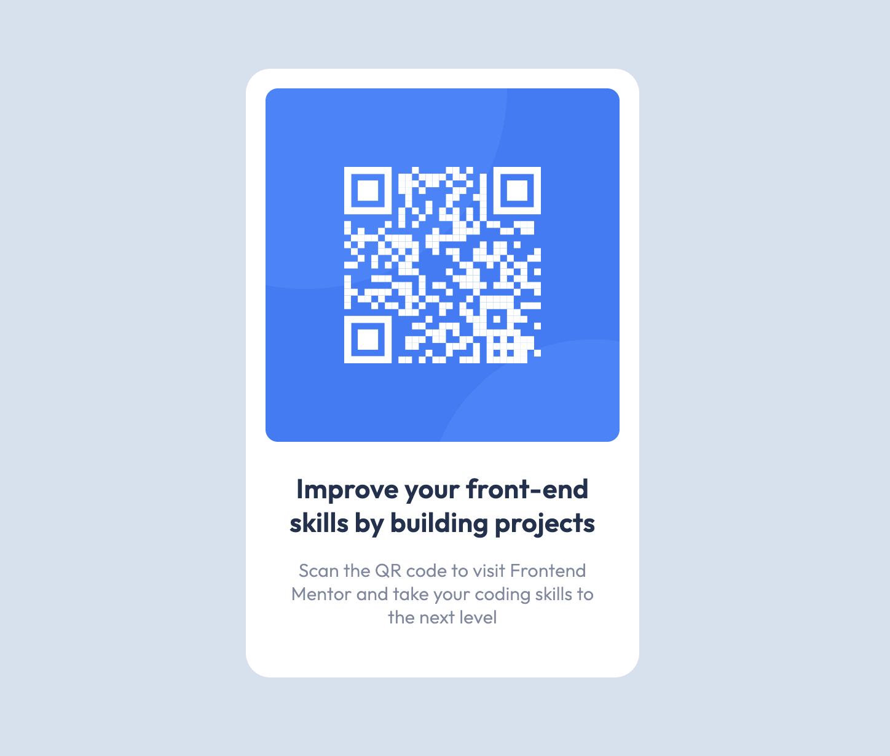

# Frontend Mentor - QR code component solution

This is a solution to the [QR code component challenge on Frontend Mentor](https://www.frontendmentor.io/challenges/qr-code-component-iux_sIO_H). Frontend Mentor challenges help you improve your coding skills by building realistic projects.

## Table of contents

- [Overview](#overview)
  - [Screenshot](#screenshot)
  - [Links](#links)
- [My process](#my-process)
  - [Built with](#built-with)
  - [What I learned](#what-i-learned)
  - [Continued development](#continued-development)
  - [Useful resources](#useful-resources)
- [Author](#author)
- [Acknowledgments](#acknowledgments)

## Overview

I've been a Frontend Mentor member for a few years but haven't truly discovered the whole platform. This project is the first project from the learning path module. Since it's aimed at beginners very early in their learning journey, I decided to try and challenge myself anyway. My objective was to not use any class names in my html as well as keeping the layout semantic to the best of my ever-evolving abilites. I also refrained from using grid or flexbox.

### Screenshot

### Links

- Solution URL: [Add solution URL here](https://your-solution-url.com)
- Live Site URL: [Live site](https://qrcodecomponentfem.netlify.app/)

## My process

- Initialized git, github, and project files
- Reviewed design files and set CSS root variables
- Implemented semantic html tags
- Styled by tag

### Built with

- Semantic HTML5 markup
- CSS custom properties

### Continued development

I'll be continuing the learning path laid out by Frontend Mentor

### Useful resources

- [Frontent Mentor Learning Path - 1](https://www.frontendmentor.io/learning-paths) - Great resource for getting started with Frontend Mentor!

## Author

- Website - [Steve Xero](https://www.stevexero.com) - under construction
- Old [Website](https://www.steven-woodward.com)
- GitHub - [Steve Xero](https://www.github.com/stevexero)
- Frontend Mentor - [@stevexero](https://www.frontendmentor.io/profile/stevexero)
- X - [@steve_xero](https://www.twitter.com/steve_xero)
